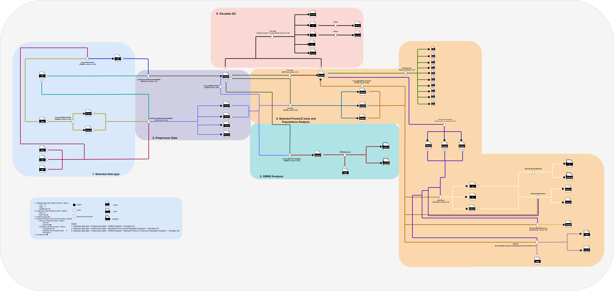

# Nextflow-GWAS-PopGen

## หัวข้อ
1. [บทนำ](#1-บทนำ)
2. [การใช้งาน Nextflow-GWAS-PopGen](#2-การใช้งาน-Nextflow-GWAS-PopGen)
3. [การเตรียมเครื่องมือและข้อมูลสำหรับ Nextflow-GWAS-PopGen](#3-การเตรียมเครื่องมือและข้อมูลสำหรับ-Nextflow-GWAS-PopGen)
4. [รายละเอียดขั้นตอนใน Nextflow-GWAS-PopGen](#4-รายละเอียดขั้นตอนใน-Nextflow-GWAS-PopGen)
5. [Output](#5-Output)
   
---
## 1. บทนำ
 Nextflow-GWAS-PopGen เป็น bioinformatics pipline ที่พัฒนาขึ้นสำหรับการเคราะห์ GWAS และ PopGen โดยจะมีขั้นตอนดังต่อไปนี้ 
1. Selected data type
2. Preprocess Data
3. GWAS Analysis
4. Selected PruneLD Tools and Population anlysis
5. Visualize QC
   


## 2-การใช้งาน-Nextflow-GWAS-PopGen 
### For vcf file
#### GWAS
```bash
nextflow run -profile gb main.nf --vcfgzFile data/inputonebase.vcf.gz --traitsFile /nbt_main/share/pachyderm/gwasrice/datauserupload/sampleinonebase/inputtrat2.txt \
     --QCTools BCFTools \
     --method MLM \
     --analyze GWAS \
     --output result
```
#### PopGen
```bash
nextflow run -profile gb main.nf --vcfgzFile data/inputonebase.vcf.gz --traitsFile /nbt_main/share/pachyderm/gwasrice/datauserupload/sampleinonebase/inputtrat2.txt \
     --QCTools BCFTools \
     --method MLM \
     --PruneLDTools PLINK \
     --analyze PopGen \
     --PopGenTools phylo,faststructure,ipcaps \
     --output result
```
#### BOTH
```bash
nextflow run -profile gb main.nf --vcfgzFile data/inputonebase.vcf.gz --traitsFile /nbt_main/share/pachyderm/gwasrice/datauserupload/sampleinonebase/inputtrat2.txt \
     --QCTools BCFTools \
     --method MLM \
     --PruneLDTools PLINK \
     --analyze BOTH \
     --PopGenTools phylo,admixture,ipcaps \
     --output result
```
### For hmp file
#### GWAS
```bash
nextflow run -profile gb main.nf --hmpFile data/inputonebase.hmp.txt --traitsFile /nbt_main/share/pachyderm/gwasrice/datauserupload/sampleinonebase/inputtrat2.txt \
     --QCTools BCFTools \
     --method MLM \
     --analyze GWAS \
     --output result
```
#### PopGen
```bash
nextflow run -profile gb main.nf --hmpFile data/inputonebase.hmp.txt --traitsFile /nbt_main/share/pachyderm/gwasrice/datauserupload/sampleinonebase/inputtrat2.txt \
     --QCTools BCFTools \
     --method MLM \
     --PruneLDTools PLINK \
     --analyze PopGen \
     --PopGenTools phylo,faststructure,ipcaps \
     --output result
```
#### BOTH
```bash
nextflow run -profile gb main.nf --hmpFile data/inputonebase.hmp.txt --traitsFile /nbt_main/share/pachyderm/gwasrice/datauserupload/sampleinonebase/inputtrat2.txt \
     --QCTools BCFTools \
     --method MLM \
     --PruneLDTools PLINK \
     --analyze BOTH \
     --PopGenTools phylo,admixture,ipcaps \
     --output result
```
## 3. การเตรียมเครื่องมือและข้อมูลสำหรับ Nextflow-GWAS-PopGen
### เครื่องมือ
1. Nextflow: version 19 
### การเตรียม config
ผู้ใช้งานสามารปรับแต่งเครื่องมือที่ใช้งานในไฟล์ gb.config ให้เหมาะสมกับทรัพยากรในเครื่อง โดย gb.config จะทำงานรวมกับ nextflow.config โดยจะใช้ตัวเลือก `-profile` เพื่อเลือก config ที่จะใช้งาน
```bash
process {
  executor = 'slurm'
  queue = 'memory'
  cache = 'lenient'

  withName: TrimHmpAndTraits {
    module = 'Python/3.7.4-GCCcore-8.3.0'
    cpus = 8
  }

  withName: ConvertHapMapToMapPed {
    module = 'TASSEL/5.2.59'
    cpus = 12
    memory = "128 GB"
  }

  withName: CheckTypeHapmap {
    module = 'TASSEL/5.2.59'
    cpus = 2
    memory = "8 GB"
  }

  withName: ConvertBedBimFamToMapPed {
    module = 'PLINK/1.9b_4.1-x86_64'
    cpus = 2
    memory = "16 GB"
  }

  withName: ConvertBedBimFamToVCF {
    module = 'PLINK/1.9b_4.1-x86_64:BCFtools/1.17-GCC-12.2.0'
    cpus = 2
    memory = "16 GB"
  }

  withName: ConvertMapPedToVCF {
    module = 'PLINK/1.9b_4.1-x86_64:BCFtools/1.17-GCC-12.2.0'
    cpus = 2
    memory = "8 GB"
  }

  withName: ConvertVCFToHapMap {
    module = 'TASSEL/5.2.59'
    cpus = 2
    memory = "16 GB"
  }

  withName: ConvertHapMapToVCF {
    module = 'TASSEL/5.2.59:BCFtools/1.17-GCC-12.2.0'
    cpus = 2
    memory = "16 GB"
  }

  withName: ConvertVCFToMapPed {
    module = 'PLINK/1.9b_4.1-x86_64'
    cpus = 12
    memory = "128 GB"
  }

  withName: ConvertVCFToBedBimFam {
    module = 'PLINK/1.9b_4.1-x86_64'
    cpus = 12
    memory = "128 GB"
  } 

  withName: ConvertMapPedToHapMap {
    module = 'TASSEL/5.2.59'
    cpus = 12
    memory = "128 GB"
  }

  withName: VCFstats_GWAS {
    module = 'VCFtools/0.1.16-GCC-11.3.0:Python/3.10.4-GCCcore-11.3.0'
    cpus = 4
    memory = "8 GB"
  }

  withName: VCFstats_PopGen {
    module = 'VCFtools/0.1.16-GCC-11.3.0:Python/3.10.4-GCCcore-11.3.0'
    cpus = 4
    memory = "8 GB"
  }  

  withName: IPCAPs {
    container = '/nbt_main/share/singularity/r_ldheatmap_ipcaps.sif'
    cpus = 12
    memory = "128 GB"
  }

  withName: TestGAPIT {
    container = '/nbt_main/share/singularity/r_ldheatmap_ipcaps.sif'
  }

  withName: Admixture {
    module = 'ADMIXTURE/1.3.0'
    cpus = 12
    memory = "128 GB"
  }

  withName: AdmixtureIter1 {
    module = 'ADMIXTURE/1.3.0'
    cpus = 12
    memory = "128 GB"
  }

  withName: AdmixtureIter2 {
    module = 'ADMIXTURE/1.3.0'
    cpus = 12
    memory = "128 GB"
  }

  withName: AdmixtureIter3 {
    module = 'ADMIXTURE/1.3.0'
    cpus = 12
    memory = "128 GB"
  }

  withName: SummarizeAdmixture {
    cpus = 1
  }

  withName: Phylogenetic {
    //module = 'Python/2.7.15-foss-2018b:RAxML/8.2.9-foss-2018b-hybrid-avx2'
    module = 'PLINK/2.00a3.6-GCC-11.3.0:Python/2.7.15-foss-2018b'
    cpus = 12
    memory = "256 GB"
  }

  withName: StructureByFastStructure {
    container = '/nbt_main/share/singularity/faststructure:1.0--py27hfaf7806_1'
    //module = 'Python/2.7.15-foss-2018b:fastStructure/1.0-foss-2019a-Python-2.7.15'
    cpus = 12
    memory = "128 GB"
  }

  withName: QualityControlByPLINK {
    module = 'PLINK/1.9b_4.1-x86_64'
    cpus = 4
    memory = "8 GB"
  }

  withName: PruneLDByPLINK {
    module = 'PLINK/1.9b_4.1-x86_64'
    cpus = 2
    memory = "16 GB"
  }

  withName: QualityControlByBCFTools {
    module = 'BCFtools/1.17-GCC-12.2.0'
    cpus = 4
    memory = "8 GB"
  }

  withName: PruneLDByBCFTools {
    module = 'BCFtools/1.17-GCC-12.2.0'
    cpus = 2
    memory = "16 GB"
  }

  withName: GWASAnalysis {
    container = '/nbt_main/share/singularity/r_ldheatmap_ipcaps.sif'
    cpus = 12
    memory = "256 GB"

  }

  withName: WEKAConvertFromCSV {
    module = 'WEKA/custom-Java-1.8.0_201'
    cpus = 2
    memory = "16 GB"
  }

  withName: WekaFilterNumericAttributesToNominal {
    module = 'WEKA/custom-Java-1.8.0_201'
    cpus = 2
    memory = "16 GB"
  }

  withName: WekaInfoGainAttributeEval {
    module = 'WEKA/custom-Java-1.8.0_201'
    cpus = 2
    memory = "16 GB"
  }

  withName: ParseFilterAndBayesClassifyByTopN {
    module = 'WEKA/custom-Java-1.8.0_201'
    cpus = 1
    memory = "4 GB"
  }

}

singularity {
    enabled = true
    autoMounts = true
}
```
## 4. รายละเอียดขั้นตอนใน Nextflow-GWAS-PopGen
### Selected data type
### Preprocess Data
### GWAS Analysis
### Selected PruneLD Tools and Population anlysis
### Visualize QC
## 5. Output
### ภาพรวม Output
```bash
Annotations
└── ANN_snpEff
     ├── {samples}.ann.vcf.gz 
     ├── {samples}_summary.genes.txt       
     └── {samples}_summary.html
```

```bash
Annotations_custom
├── BuildCustomDB
│    ├──snpeff_build.log
└── ANN_snpEff
     ├── {samples}.ann.vcf.gz 
     ├── {samples}_summary.genes.txt       
     └── {samples}_summary.html
```

```bash
Annotations
├── ANN_SnpSift
│    ├──{samples}_SnpSift.vcf.gz
└── ANN_snpEff
     ├── {samples}.ann.vcf.gz 
     ├── {samples}_summary.genes.txt       
     └── {samples}_summary.html
```

```bash
Annotations
├── Call_ANN
│    ├── {samples}_overlap_shared.vcf.gz
├── Combine_VCF
│    ├── {samples}_combine.vcf.gz
├── Compare_results
│    ├── {samples}_overlap.vcf.gz
│    └── {samples}_unique.vcf.gz
└── ANN_snpEff
     ├── {samples}.ann.vcf.gz 
     ├── {samples}_summary.genes.txt       
     └── {samples}_summary.html
```
